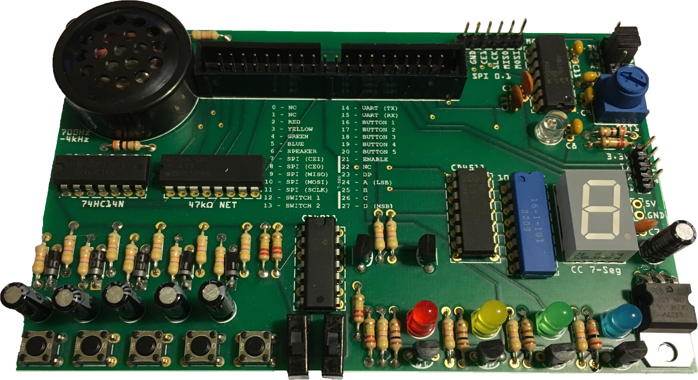

# RPi3 Accessory Board

A basic interface device designed for the Raspberry Pi 3, built for students learning realtime development.

# Features
* Five pushbuttons and two switches, with hardware debounce
* Four LEDs
* Speaker
* BCD 7-Segment display
* 10-Bit 4-channel SPI ADC
  * Potentiometer and phototransistor attached
* Headers:
  * Power (both 3.3V and 5V)
  * SPI bus with one available chip-select line
  * UART
* Labels:
  * Physical pin numbering
  * RPi3 pin numbering (BCM)
  * Speaker frequency range
  * ADC clock rate range

Designed with Fritzing, manufactured by Aisler ([board ordering available here](http://go.aisler.net/p/HHGNQZQE)), and all parts sourced from DigiKey ([cart export here](digikey_parts_export.csv))*.

Price is roughly $48 each, $62 per three boards, $28 per board for parts.

*Prototype LEDs sourced from Jameco, DigiKey LED quality has not been verified.
